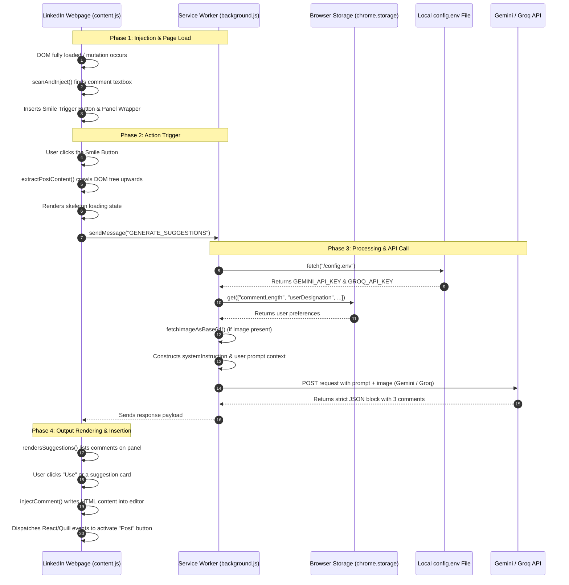

# popup is used for user settings
# content script is used for content scraping and DOM manupulation
# background script is used for api calls


# LinkedIn AI Comment Assistant - Step-by-Step Execution Flow

This document details the step-by-step lifecycle and data flow of the LinkedIn AI Comment Assistant extension. It explains exactly what happens from the moment the browser starts up to when a comment is generated and posted.

---

## Architecture Overview

The extension is composed of three main layers that communicate asynchronously:
1. **The Extension Settings (Popup)**: Manages preferences and API keys.
2. **The Content Script (`content.js`)**: Runs in the context of the LinkedIn webpage, scrapes text/images, and manipulates the commenting DOM elements.
3. **The Background Service Worker (`background.js`)**: Fetches remote assets and communicates directly with the Gemini and Groq API endpoints.



---

## Detailed Step-by-Step Execution Lifecycle

### Phase 1: Installation & Webpage Matching
1. **Browser Bootstrapping**:
   When Google Chrome (or any Chromium browser) loads, it reads the `manifest.json` file. It registers the background worker (`background.js`) and prepares matching patterns for web traffic.
2. **Tab Load Match**:
   When you navigate to any URL matching `https://*.linkedin.com/*`, Chrome automatically injects two files into the tab:
   * **`content.css`**: Injected to apply the design system, colors, animations, and layouts.
   * **`content.js`**: Injected to begin inspecting the page DOM.

---

### Phase 2: DOM Scan & Button Injection
3. **Triggering the Initial Scan**:
   Once the page reports a DOM status of `DOMContentLoaded` (or if it is already loaded), `initObserver()` in `content.js` starts.
4. **Setting Up Observers**:
   LinkedIn is a Single Page Application (SPA), meaning posts load dynamically as you scroll. To handle this, `content.js` sets up:
   * A **MutationObserver** to watch for new nodes added to the document body.
   * Event listeners on **User clicks** (like clicking "Comment") to force immediate scans.
   * A fallback interval timer that scans every 3 seconds.
5. **Scanning for Editors**:
   The function `scanAndInject()` searches for textboxes using selectors like:
   `div[contenteditable="true"]`, `.ql-editor[contenteditable="true"]`, and `div[role="textbox"]`.
6. **Injecting UI Elements**:
   For every new editor box found:
   * It marks the elements with `data-ln-ai-injected="true"` so it doesn't inject buttons multiple times.
   * It creates the **Smile Trigger Button** (`smileBtn`) containing the smiley SVG.
   * It appends the button to the editor action bar.
   * It inserts an hidden **Suggestions Panel Wrapper** right below the post.

---

### Phase 3: Scraping & Background Messaging
7. **Button Click Action**:
   When the user clicks the injected Smile Button, the click event is captured. The panel wrapper displays a shimmer loading skeleton placeholder.
8. **Upward DOM Traversal**:
   The helper function `extractPostContent()` starts from the active textbox and walks **upwards** through the HTML parent tags.
   * It searches for text elements matching description selectors (e.g. `.feed-shared-update-v2__commentary`, `span.break-words`).
   * It searches for post images matching image container classes.
   * Once it successfully resolves clean text or a valid full-size image, it stops and packages this data.
9. **Messaging the background service worker**:
   `content.js` fires off an asynchronous message:
   ```javascript
   chrome.runtime.sendMessage({
     action: 'GENERATE_SUGGESTIONS',
     postText: postText,
     imageUrl: imageUrl
   }, response => { ... })
   ```

---

### Phase 4: API Processing & Fallbacks
10. **Receiving Message in Service Worker**:
    In `background.js`, `chrome.runtime.onMessage.addListener` intercepts the request. It extracts `postText` and `imageUrl` and triggers `handleGenerateSuggestions()`.
11. **Fetching Configurations**:
    The background worker reads the local `config.env` file to fetch the API credentials (`GEMINI_API_KEY` and `GROQ_API_KEY`), and pulls user style configurations (default tone, designation, comment length) from Chrome local storage.
12. **Image Conversion (If Image Exists)**:
    If the post contained an image, `fetchImageAsBase64()` makes a fetch request to download the image array buffer and converts it to a service-worker-safe base64 string.
13. **Constructing prompt context**:
    It customizes the system rules with instructions depending on settings:
    * **Length**: Add instructions for short, medium, or long formats.
    * **Emojis**: Instruct model to either include or strictly avoid emojis.
    * **Role**: Append role-specific instructions (e.g. "Speak like a Software Engineer").
14. **Calling Gemini (Primary)**:
    If the Gemini key is present, it issues a POST request to `generativelanguage.googleapis.com` targeting `gemini-2.5-flash`. It requests strict JSON structures (`responseMimeType: "application/json"`).
15. **Falling Back to Groq**:
    If the Gemini call fails or there is no Gemini key, it checks for a Groq key.
    * If there's an image, it targets `llama-3.2-11b-vision-preview`.
    * If it is text-only, it targets `llama-3.3-70b-versatile`.
16. **Returning Data**:
    Once parsed, `background.js` returns the JSON comments:
    ```json
    {
      "insightful": "...",
      "appreciative": "...",
      "inquisitive": "..."
    }
    ```

---

### Phase 5: Suggestion Display & Injection
17. **Displaying Suggestion Cards**:
    `content.js` receives the JSON payload, removes the skeleton loaders, and renders three suggestion cards corresponding to the *insightful*, *appreciative*, and *inquisitive* styles.
18. **User Selection**:
    The user can either copy a comment to their clipboard or click **"Use"** / click the card body.
19. **Quill/React Input Injection**:
    When clicked, the function `injectComment()` replaces the editor's inner HTML with the text wrapped in paragraph tags: `<p>${commentText}</p>`.
20. **Simulating Interactive Events**:
    Simply changing the HTML doesn't trigger LinkedIn's native framework validation. To trick LinkedIn's React framework into recognizing that text was added (which activates the native "Post" button), the extension dispatches three sequential input events:
    * `input` (bubbles: true)
    * `change` (bubbles: true)
    * `keyup` (bubbles: true)
21. **Focusing Cursor**:
    The script programmatically moves the blinking cursor to the end of the newly injected text so the user can immediately edit it if desired.
